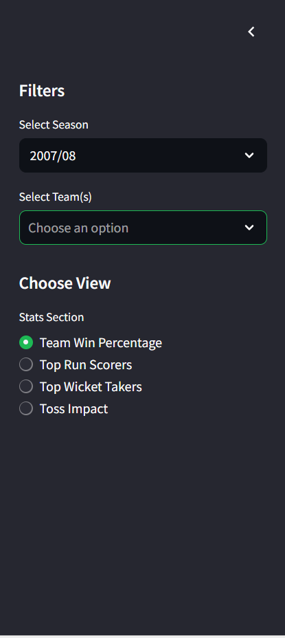
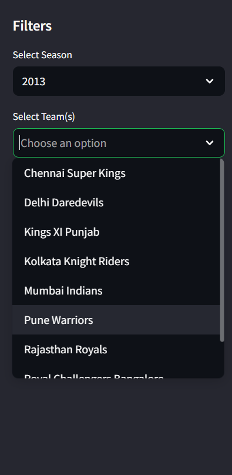
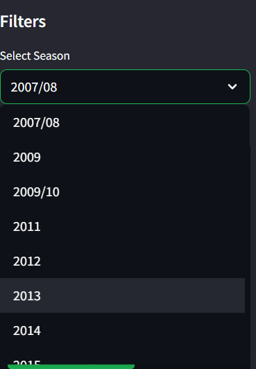

# 🏏 IPL Stats Explorer – Interactive Dashboard

An interactive and visually appealing web application to explore IPL match statistics using **Python**, **Pandas**, **Plotly**, and **Streamlit**.

---

## 📌 Project Overview

The **IPL Stats Explorer** lets fans, analysts, and data enthusiasts:

- Analyze team win percentages
- Explore top batters and bowlers
- Understand toss impacts
- Filter by seasons and teams
- Visualize trends using interactive graphs

Built using **clean modular code**, the app offers an intuitive and dynamic interface for cricket data analytics.

---

## 🚀 Features

| Feature              | Description                                       |
| -------------------- | ------------------------------------------------- |
| 📊 Team Win %        | Win percentage of each team (season-filtered)     |
| 🧢 Top Batters       | Shows top run scorers overall or season-wise      |
| 🎯 Top Bowlers       | Wicket tally leaders                              |
| 🧠 Toss Impact       | Calculates how often toss winners also win match  |
| 📅 Season + Team Filters | Interactive sidebar to customize your view      |

---

## 🛠️ Tech Stack

- **Python**
- **Pandas** – Data manipulation
- **Plotly** – Dynamic, interactive charts
- **Streamlit** – Fast, beautiful frontend
- **Jupyter/VS Code** – For development

---

## 📁 Project Structure

ipl-stats-explorer/
├── data/ # Raw datasets (matches.csv, deliveries.csv)
├── analysis.py # Data logic and helper functions
├── ipl_app.py # Streamlit app logic
├── .streamlit/config.toml # Streamlit theme config
├── requirements.txt # Python dependencies
└── README.md # You're here!


---

## 📊 Dataset Used

Kaggle IPL dataset (2008–2020):  
📎 [Download Here](https://www.kaggle.com/datasets/patrickb1912/ipl-complete-dataset-2008-2020)

- `matches.csv`: Match-level info
- `deliveries.csv`: Ball-by-ball performance

---

## 📸 Screenshots

### 🏠 Dashboard Overview


### 🎛️ Filters Sidebar


### 🧢 Team & Year Selection



### 🏏 Top Run Scorer Visualization


---

## 💡 Future Enhancements

- Player & Match search 🔍
- Head-to-head team comparison 📈
- Predictive modeling using ML 🔮
- Deployment to Streamlit Cloud ☁️

---

## 📦 Installation

```bash
git clone https://github.com/Sinchana0224/ipl-stats-explorer.git
cd ipl-stats-explorer
pip install -r requirements.txt
streamlit run ipl_app.py

---

##👩‍💻 Made by Sinchana
-- A project built to sharpen my data science, visualization, and web app skills as part of my placement preparation journey. Feedback and suggestions are welcome!


